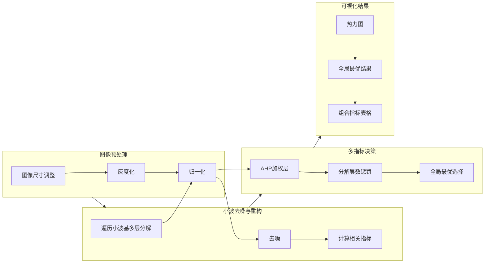

```mermaid


graph LR
    subgraph 图像预处理
        direction TD
        图像尺寸调整 --> 灰度化 --> 归一化
    end
    subgraph 小波去噪与重构
        direction TD
        遍历小波基多层分解 --> 归一化 --> 去噪 --> 计算相关指标
    end
    subgraph 多指标决策
        direction TD
        归一化 --> AHP加权层 --> 分解层数惩罚 --> 全局最优选择
    end
    subgraph 可视化结果
        direction TD
        热力图 --> 全局最优结果 --> 组合指标表格
    end
    图像预处理 --> 小波去噪与重构 --> 多指标决策 --> 可视化结果
```