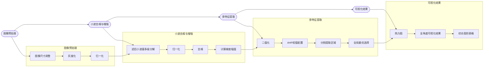

```mermaid
flowchart LR
    %% 顶层阶段
    T1([图像预处理]) --> T2([小波去噪与增强])
    T2 --> T3([多特征提取])
    T3 --> T4([可视化结果])

    %% 顶层到子模块的垂直连线
    T1 --> A1
    T2 --> B1
    T3 --> C1
    T4 --> D1

    %% 子模块1：图像预处理
    subgraph 图像预处理
      direction TB
      A1[图像尺寸调整]
      A2[灰度化]
      A3[归一化]
      A1 --> A2 --> A3
    end

    %% 子模块2：小波去噪与增强
    subgraph 小波去噪与增强
      direction TB
      B1[滤后小波基多级分解]
      B2[归一化]
      B3[去噪]
      B4[计算梯度幅值]
      B1 --> B2 --> B3 --> B4
    end

    %% 子模块3：多特征提取
    subgraph 多特征提取
      direction TB
      C1[二值化]
      C2[AHP权值配置]
      C3[分割提取区域]
      C4[全局最优选择]
      C1 --> C2 --> C3 --> C4
    end

    %% 子模块4：可视化结果
    subgraph 可视化结果
      direction TB
      D1[热力图]
      D2[全角度可视化结果]
      D3[综合图形表格]
      D1 --> D2 --> D3
    end

    %% 子模块间横向连接
    A3 --> B1
    B4 --> C1
    C4 --> D1

```