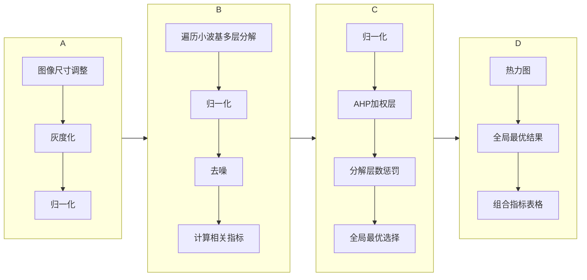

```mermaid
graph LR
    A[图像预处理] --> B[小波去噪与重构] --> C[多指标决策] --> D[可视化结果]
    subgraph A
        A1[图像尺寸调整] --> A2[灰度化] --> A3[归一化]
    end
    subgraph B
        B1[遍历小波基多层分解] --> B2[归一化] --> B3[去噪] --> B4[计算相关指标]
    end
    subgraph C
        C1[归一化] --> C2[AHP加权层] --> C3[分解层数惩罚] --> C4[全局最优选择]
    end
    subgraph D
        D1[热力图] --> D2[全局最优结果] --> D3[组合指标表格]
    end


```