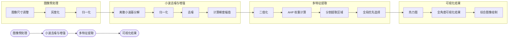

```mermaid
flowchart LR
    %% 顶部阶段名称及流程箭头
    T1([图像预处理]) --> T2([小波去噪与增强])
    T2 --> T3([多特征提取])
    T3 --> T4([可视化结果])

    %% 图像预处理模块（纵向排列）
    subgraph 图像预处理
        direction TB
        A1[图像尺寸调整]
        A2[灰度化]
        A3[归一化]
        A1 --> A2 --> A3
    end

    %% 小波去噪与增强模块（纵向排列）
    subgraph 小波去噪与增强
        direction TB
        B1[离散小波基分解]
        B2[归一化]
        B3[去噪]
        B4[计算梯度幅值]
        B1 --> B2 --> B3 --> B4
    end

    %% 多特征提取模块（纵向排列）
    subgraph 多特征提取
        direction TB
        C1[二值化]
        C2[AHP 权重计算]
        C3[分割提取区域]
        C4[全局优先选择]
        C1 --> C2 --> C3 --> C4
    end

    %% 可视化结果模块（纵向排列）
    subgraph 可视化结果
        direction TB
        D1[热力图]
        D2[全角度可视化结果]
        D3[综合图像绘制]
        D1 --> D2 --> D3
    end

    %% 模块间的流程连接
    A3 --> B1
    B4 --> C1
    C4 --> D1

```